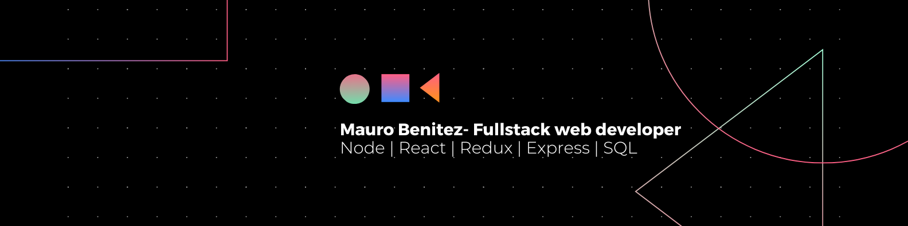

 

<h1>Acerca de mi</h1>

Hola, mi nombre es Mauro Benitez, gracias por interesarte en mi. Soy egresado del bootcamp Soy Henry. Además de haber cursado el bootcamp Soy Henry soy estudiante de la carrera licenciatura en sistemas en la Universidad Nacional de Tierra del Fuego. Durante mi tiempo en el bootcamp, aprendí habilidades valiosas en tecnologías frontend y backend. Estoy emocionado de comenzar mi carrera en esta industria y utilizar mis habilidades para contribuir a proyectos emocionantes.

<h2>🧑🏻 Mi background 📚</h2>

Siempre me ha interesado la tecnología, así que cuando me ofrecieron tomar una clase de programación en la secundaria, no dudé en inscribirme.

La clase de programación fue una revelación para mí. Me encantó aprender cómo escribir código y ver cómo mis programas se ejecutaban en la computadora. Me emocionaba ver cómo podía hacer que la computadora hiciera cosas interesantes y útiles.

Después de la clase de programación, empecé a programar por diversión en mi tiempo libre. Descubrí que me gustaba mucho resolver problemas y encontrar soluciones creativas a través del código.

Debido a mi interés en la programación, decidí inscribirme en la universidad para estudiar licenciatura en sistemas. La carrera me brindó una educación más profunda en el campo del desarrollo de software, incluyendo temas como programación orientada a objetos, bases de datos, sistemas operativos y análisis de algoritmos.

<h2>🚀 Mis aspiraciones profesionales 💼</h2>

Busco poner en práctica mis habilidades y conocimientos adquiridos en el bootcamp. Estoy en busca de una oportunidad en una empresa dinámica donde pueda contribuir al crecimiento de la empresa y al mismo tiempo continuar desarrollando mis habilidades como desarrollador.

Me gustaría trabajar en proyectos desafiantes que me permitan utilizar mis habilidades en desarrollo front-end y back-end y colaborar con un equipo de desarrolladores experimentados que me puedan enseñar y guiar en mi carrera profesional. Además, estoy interesado en seguir aprendiendo y manteniéndome actualizado con las últimas tendencias y tecnologías en el campo del desarrollo de software.

<h2>⚙️ SKILLS ⚙️</h2>

➖ React

➖ HTML

➖ CSS

➖ Javascript

➖ SQL

➖ React

➖ Express

➖ Sequelize

➖ Node.js

➖ Scrum

<h3>Contáctame!💌</h3>

📧 email: maurogabrielbenitez@gmail.com

🖥️ github: maurobenitez

